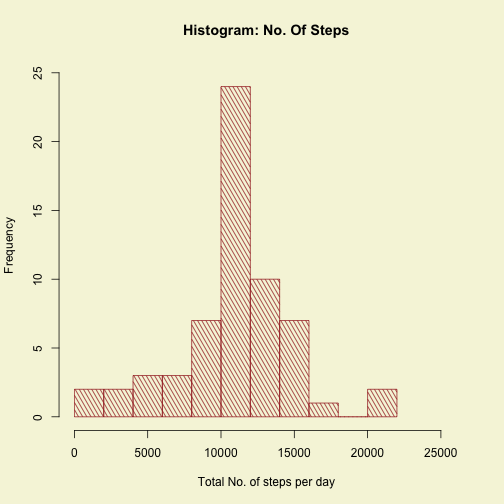

### Introduction
It is now possible to collect a large amount of data about personal movement using activity monitoring devices such as a Fitbit, Nike Fuelband, or Jawbone Up. These type of devices are part of the "quantified self" movement - a group of enthusiasts who take measurements about themselves regularly to improve their health, to find patterns in their behavior, or because they are tech geeks. But these data remain under-utilized both because the raw data are hard to obtain and there is a lack of statistical methods and software for processing and interpreting the data.   
This assignment makes use of data from a personal activity monitoring device. This device collects data at 5 minute intervals through out the day. The data consists of two months of data from an anonymous individual collected during the months of October and November, 2012 and include the number of steps taken in 5 minute intervals each day.
#### Requirements to run
```
Make a directory named as "data" in your working directory to store the raw data.
```
#### Loading the libraries

```r
library(data.table)
library(knitr)
library(dplyr)
library(ggplot2)
library(xtable)
opts_chunk$set(echo = TRUE, results = 'hold')       
#Define Text results. hold output pieces and push them to end of chunk
```

#### Specifying the URL and name of the file to be stored 

```r
fileURL<-"https://d396qusza40orc.cloudfront.net/repdata%2Fdata%2Factivity.zip"
fileStoredName<-"ActivityMonitorData"
```
#### Defining a function to load the data with try cases

```r
getData<-function(fileOpen="ActivityMonitorData",direct="R_programming"){
      print(paste("The present working directory is:",workingDir<-getwd()))
      date<-format(Sys.Date(),"%Y")
      newFileName<-paste(fileStoredName,date,sep = "-")
      fileList<-list.files()
      if(sum("data"==fileList)>0){
            if(!file.exists(paste("./data/",newFileName,".zip",sep=""))){
                  download.file(fileURL,method="curl",destfile = paste("./data/",newFileName,".zip",sep=""))
                  if(!file.exists(paste("./data/",newFileName,sep="")))
                        unzip(zipfile=paste("./data/",newFileName,
                                            ".zip",sep=""), exdir=paste("./data/",newFileName,sep=""))
            }
      }
      else
            print("You seem to be in a different directory")
      actualDoc<-list.files(paste("./data/",newFileName,sep=""),full.names = T)
      
      output<- tryCatch(
            {
                  fread(actualDoc,sep=",",header=T,data.table = TRUE)
            },
            error=function(cond){
                  message(paste("file does not seem to exist:", actualDoc))
                  message("Here's the original error message:")
                  message(cond)
                  return(2)
            },
            warning=function(cond) {
                  message(paste("file caused a warning:", actualDoc))
                  message("Here's the original warning message:")
                  message(cond)
                  return(3)
            },
            finally={
                  message(paste("Processed file: ", actualDoc," was opened successfully"))
            }
      )
      output
}
```

#### Calling the function to load the data


```r
activityData<-getData()
```

```
## Processed file:  ./data/ActivityMonitorData-2015/activity.csv  was opened successfully
```

#### Preprocessing the data

```r
activityData$recordDate<-as.Date(strptime(activityData$date,"%Y-%m-%d"))
activityData<-mutate(activityData, steps=as.numeric(steps))
```
#### str() view of the preprocessed data


```
## Classes 'data.table' and 'data.frame':	17568 obs. of  4 variables:
##  $ steps     : num  NA NA NA NA NA NA NA NA NA NA ...
##  $ date      : chr  "2012-10-01" "2012-10-01" "2012-10-01" "2012-10-01" ...
##  $ interval  : int  0 5 10 15 20 25 30 35 40 45 ...
##  $ recordDate: Date, format: "2012-10-01" "2012-10-01" ...
##  - attr(*, ".internal.selfref")=<externalptr>
```

---
1. <u>What is mean total number of steps taken per day?</u>
---
---

#### Processing the data to get the mean ,median and total steps taken in a day

```r
groupedActivityData<-group_by(activityData, recordDate)
summary<-summarize(groupedActivityData, meanSteps=mean(steps,na.rm = T), totalSteps=sum(steps,na.rm =T),
                   medianSteps=median(steps,na.rm=T))
maximumSteps=max(summary$totalSteps)
```
---
Calculate the total number of steps taken per day
---
The Total steps in a day are:

```
##  [1]     0   126 11352 12116 13294 15420 11015     0 12811  9900 10304
## [12] 17382 12426 15098 10139 15084 13452 10056 11829 10395  8821 13460
## [23]  8918  8355  2492  6778 10119 11458  5018  9819 15414     0 10600
## [34] 10571     0 10439  8334 12883  3219     0     0 12608 10765  7336
## [45]     0    41  5441 14339 15110  8841  4472 12787 20427 21194 14478
## [56] 11834 11162 13646 10183  7047     0
```
---
Make a time series plot (i.e. type = "l") of the 5-minute interval (x-axis) and the average number of steps taken, averaged across all days (y-axis)
---
#### A histogram of the Total number of steps per day.


```r
par(mfrow=c(1,1),bg="beige")
hist(summary$totalSteps, main = "Histogram: No. Of Steps", xlab="Total No. of steps per day",
     angle=120, col="brown", density=20,xlim=c( 0 , maximumSteps+5000),ylim=c(0,20),breaks=10)
```

 

```r
#<--!barplot(summary$total,names.arg = summary$recordDate, angle= 60, density= 20, col="gold", main="Bar Plot: No. Of Steps", ylab="Total No. of steps", xlab="days", axisnames = T, cex.names = 0.5, axes=T,axis.lty = 1,xpd = T,las=2,pos=1,beside = F)-->
```
---
Calculate and report the mean and median of the total number of steps taken per day
---

#### The mean and median of the total steps per day are below:


```r
mean(summary$totalSteps)
```

```
## [1] 9354.23
```

```r
median(summary$totalSteps)
```

```
## [1] 10395
```
---
2. <u>What is the average daily activity pattern?</u>
---
---
#### Processing the data to get the mean number of steps per 5 minute interval

```r
k <- aggregate(activityData$steps, by= list(activityData$interval),FUN = mean, na.rm=T)
```
---
Make a time series plot (i.e. type = "l") of the 5-minute interval (x-axis) and the average number of steps taken, averaged across all days (y-axis)
---

#### A graph of the average number of steps per 5-Minute-Interval.


```r
par(mfrow=c(1,1),bg="beige")
plot(k$Group.1,k$x, type ="l",main="Time Series Plot of Average No. of Steps",
     xlab="5 minute Intervals", ylab="average steps taken", col="blue",xaxt="n")
axis(1,labels=T, las=2)
abline(h=maximum<-max(k$x),col="magenta", lwd=1)
abline(v=maximumInterval<-k$Group.1[k$x==max(k$x)],col="magenta",lwd=1)
text(y=150,x=round(k$Group.1[k$x==max(k$x)],3)-90,paste("max. Interval is=",round(maximumInterval,3)),
     col="magenta1", srt=90)
```

 
---
Report which 5-minute interval has the max average of steps?
---

#### The 5-Minute-Interval with the highest number of steps is:

```r
print(maximumInterval)
```

```
## [1] 835
```

---
3. <u>Imputing missing values</u>
---
---
---
Calculate and report the total number of missing values in the dataset
---
#### The total number of NAs in the original data is:

```r
numberOfNA<-sum(is.na(activityData$steps))
numberOfNA
```

```
## [1] 2304
```
adding a new column to the data table, containing information about the missing values

```r
newActivityData<-mutate(activityData,IsNA=is.na(activityData$steps))
```
---
Devise a strategy for filling in all of the missing values in the dataset
---
#### Filling in the missing values by replacing the NA's with the mean of the steps taken at the same time interval

```r
answer<-c()
for(i in 1:nrow(newActivityData)){
      if(newActivityData$IsNA[i])
           answer[i]<- filter(k,Group.1==newActivityData$interval[i])$x
      else
            answer[i]<-newActivityData$steps[i]
}
```
---
Create a new dataset that is equal to the original dataset but with the missing data filled in
---
This new dataframe has the estimated values of the NAs imputed in.

```r
newActivityData<-newActivityData[,steps:=answer]
```

---
Make a histogram of the total number of steps taken each day and Calculate and report the mean and median total number of steps taken per day
---
#### Processing the data to get the mean ,median and total steps taken in a day

```r
newGroupedActivityData<-group_by(newActivityData, recordDate)
newSummary<-summarize(newGroupedActivityData, meanSteps=mean(assumedSteps,na.rm = T),
                      totalSteps=sum(assumedSteps,na.rm = T), medianSteps=median(assumedSteps,na.rm=T))
```

```
## Error in mean(assumedSteps, na.rm = T): object 'assumedSteps' not found
```

#### A histogram of the Total number of steps per day.


```r
par(mfrow=c(1,1),bg="beige")
newMaximumSteps=max(newSummary$totalSteps)
hist(newSummary$totalSteps, main = "Histogram: No. Of Steps", xlab="Total No. of steps per day",
     angle= 120, col="brown", density=20,xlim=c( 0 , newMaximumSteps+5000),ylim=c(0,25),breaks=10)
```

 
---
What is the impact of imputing missing data on the estimates of the total daily number of steps?
---
#### The Total steps in a day are:

```r
print((newSummary$totalSteps))
```

```
##  [1] 10766.19   126.00 11352.00 12116.00 13294.00 15420.00 11015.00
##  [8] 10766.19 12811.00  9900.00 10304.00 17382.00 12426.00 15098.00
## [15] 10139.00 15084.00 13452.00 10056.00 11829.00 10395.00  8821.00
## [22] 13460.00  8918.00  8355.00  2492.00  6778.00 10119.00 11458.00
## [29]  5018.00  9819.00 15414.00 10766.19 10600.00 10571.00 10766.19
## [36] 10439.00  8334.00 12883.00  3219.00 10766.19 10766.19 12608.00
## [43] 10765.00  7336.00 10766.19    41.00  5441.00 14339.00 15110.00
## [50]  8841.00  4472.00 12787.00 20427.00 21194.00 14478.00 11834.00
## [57] 11162.00 13646.00 10183.00  7047.00 10766.19
```
#### The mean and median of the total steps per day are below:


```r
mean(newSummary$totalSteps)
```

```
## [1] 10766.19
```

```r
median(newSummary$totalSteps)
```

```
## [1] 10766.19
```
The new mean value is exactly the same as the original, however, the median is very slightly different. This shows that imputing values based on means does not create a large impact in the results. Because these new values were put in based on the other steps values, the data isn't too different.

---
4. <u>Are there differences in activity patterns between weekdays and weekends?</u>
---
---

---
Create a new factor variable in the dataset with two levels ??? ???weekday??? and ???weekend??? indicating whether a given date is a weekday or weekend day
---

#### Given below is the data table divided between weekdays and weekends:

```r
weekdayData<-newActivityData[,weekday:= (weekdays(newActivityData$recordDate)=="Sunday" |
                                               weekdays(newActivityData$recordDate)=="Saturday") ]
weekdayData<-mutate(weekdayData,weekday=as.factor(weekday))
levels(weekdayData$weekday)<- c("weekday", "weekend")
newK <- aggregate(weekdayData$assumedSteps, by= list(weekdayData$interval,weekdayData$weekday),
                  FUN = mean, na.rm=T)
```

```
## Error in aggregate.data.frame(as.data.frame(x), ...): no rows to aggregate
```

```r
colnames(newK) <- c("interval","day_of_week", "steps")
```

---
Make a panel plot containing a time series plot of the 5-minute interval and the average number of steps taken, averaged across all weekday days or weekend days
---
#### panel plot containing a time series of the average number of steps taken across all weekdays and weekend days

```r
qplot(interval, steps, data=newK, facets = day_of_week~.,
      main = "Activity Pattern On Weekdays vs Weekends" ) + geom_line(col="black")
```

 
